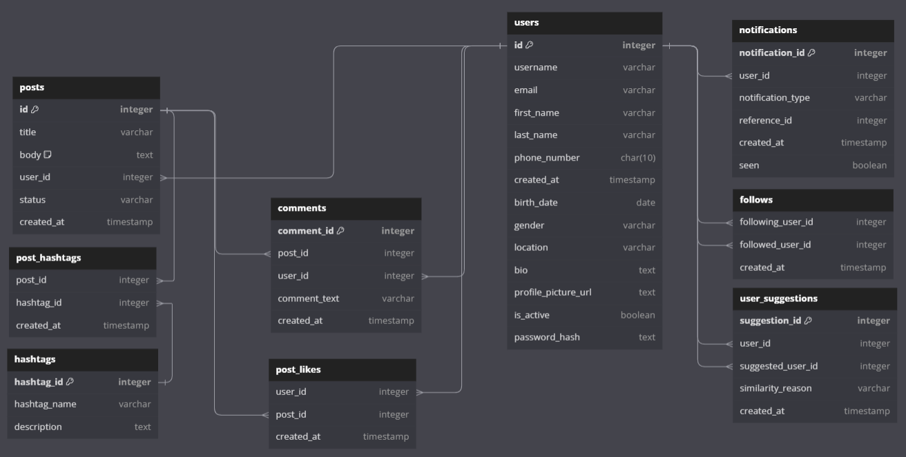

# Twitter SQL Database Project


## Description 📜

This project is a **PostgreSQL-based database design** for a Twitter-like application. It includes the necessary schemas, tables, and relationships to simulate social media functionalities such as user management, tweets, followers, comments, hashtags, notifications, and more.

The primary goal is to provide a scalable and efficient relational database structure for a social media application, ensuring data integrity through foreign key constraints, unique constraints, and checks.


`Some people still call Twitter 'X', as if the logo could change its personality. The only thing missing is for them to start calling the phone 'WhatsApp' xDD`

## Instructions to Run PowerShell Scripts 🚀

### 1. **Prerequisites** 🔧

- Make sure **PostgreSQL** 🐘 is installed and running.
- You have access to a **PostgreSQL client** (e.g., `psql`).
- Configure PowerShell 💻 to allow script execution, if needed:

```powershell
Set-ExecutionPolicy RemoteSigned
```

### 2. Run the First Script: AddPgBinToSystemPath.ps1

- Open PowerShell 💻 as Administrator.
- Run the first script that adds the PostgreSQL path to the system PATH environment variable.

### 3. Run the Second Script: setup_db.ps1
- Ensure you have configured the paths in the script according to your environment.
- Run the second script to create the database, tables, and insert sample data into the db_twitter database.

### 4. Verification ✅
- Connect to PostgreSQL 🐘 and verify the db_twitter database with its tables and inserted data.

## Folder Structure 📂

Here’s an overview of the project’s directory structure:

```sh
Twitter Database Project
    │
    ├── AddPgBinToSystemPath.ps1
    ├── setup_db.ps1
    │
    ├── 01-database-creation/
    │   └── create_database_db_twitter.sql
    │
    ├── 02-schema-creation/
    │   ├── create_auth_schema.sql
    │   └── create_social_schema.sql
    │
    ├── 03-tables-creation/
    │   ├── create_blocked_users_table.sql
    │   ├── create_comments_table.sql
    │   ├── create_followers_table.sql
    │   ├── create_hashtags_table.sql
    │   ├── create_notifications_table.sql
    │   ├── create_tweet_hashtags_table.sql
    │   ├── create_tweet_likes_table.sql
    │   ├── create_tweets_table.sql
    │   ├── create_user_suggestions_table.sql
    │   └── create_users_table.sql
    │
    ├── 04-constrains-creation/
    │   └── empty.txt
    │
    ├── 05-insert-data/
    │   ├── 01-Insert-auth.users.sql
    │   ├── 02-Insert-social.followers.sql
    │   ├── 03-Insert-social.tweets.sql
    │   ├── 04-Insert-social.tweet_likes.sql
    │   ├── 05-Insert-social.blocked_users.sql
    │   ├── 06-Insert-social.hashtags.sql
    │   ├── 07-Insert-social.comments.sql
    │   ├── 08-Insert-social.tweet_hashtags.sql
    │   ├── 09-Insert-social.user_suggestions.sql
    │   └── 10-Insert-social.notifications.sql
    │
    └── 06-db-management/
        ├── drop_db_twitter.sql
        └── terminate_connections.sql
```

## Database Diagram



## Contributing 💡

Contributions are welcome! Please follow these steps to contribute:

1. Fork the repository.
2. Create a new branch (`git checkout -b feature-branch`).
3. Commit your changes (`git commit -m 'Add new feature'`).
4. Push your changes (`git push origin feature-branch`).
5. Open a pull request.

---

## License 📝

This project is licensed under the **MIT License**. For more details, see the `LICENSE` file.

---

## Contact 📧

For any questions or feedback, please contact the project maintainer at:

**claudiodejesuschavarria@gmail.com**

<a href="https://www.linkedin.com/in/claudiochavarria/" style="display: inline-block; background-color: #0077B5; color: white; padding: 10px 20px; border-radius: 5px; text-decoration: none; font-size: 16px; font-weight: bold;">Visit my LinkedIn</a>
